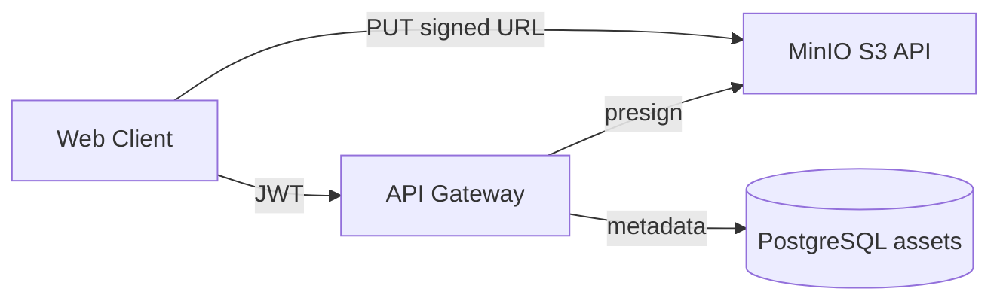

# Asset Pipeline Architecture

## Components

| Layer | Location |
|-------|----------|
| Storage service | `services/api/src/storage/` |
| Prisma model | `Asset` in `packages/database` |
| Web client | `apps/web/src/lib/assets-api.ts`, `AssetUploader` |
| Scratch manifest | `GET /api/scratch/projects/:id/assets/manifest` |

## Security

- MIME allowlist per `AssetPurpose`
- Max size per bucket
- Blocked executable extensions
- Throttled presign endpoints
- No public write ACL on buckets

## Relations

- `projectId` — Scratch, robotics, community projects
- `listingId` — Marketplace assets
- `aiSessionId` — AI Studio generated artifacts
